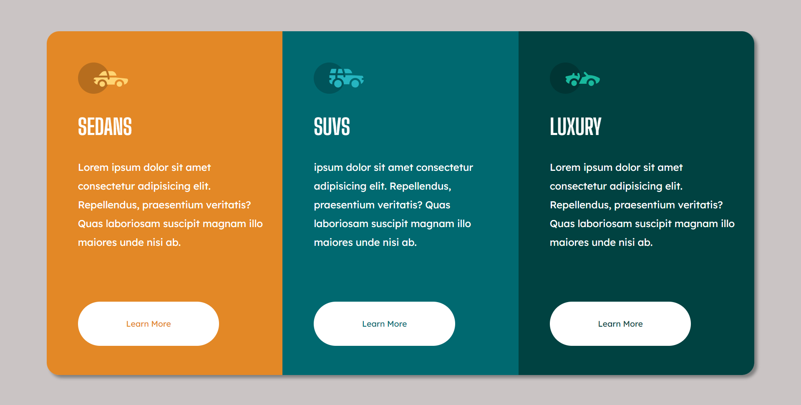

# Frontend Mentor - 3-column preview card component solution

This is a solution to the [3-column preview card component challenge on Frontend Mentor](https://www.frontendmentor.io/challenges/3column-preview-card-component-pH92eAR2-).

## Table of contents

- [Overview](#overview)
  - [The challenge](#the-challenge)
  - [Screenshot](#screenshot)
  - [Links](#links)
- [My process](#my-process)
  - [Built with](#built-with)
  - [What I learned](#what-i-learned)
  - [Useful resources](#useful-resources)
- [Author](#author)

## Overview

### The challenge

Users should be able to:

- View the optimal layout depending on their device's screen size
- See hover states for interactive elements

### Screenshot



### Links

- Solution URL: [coulum-preview-card.github.io](https://github.com/rochelwang1205/coulum-preview-card.github.io)
- Live Site URL: [Column Preview Card](https://rochelwang1205.github.io/coulum-preview-card.github.io/column-preview-card/index.html)

## My process

### Built with

- Semantic HTML5 markup
- CSS custom properties
- Flexbox

### What I learned

-how to use display and review concept of container and flex,
-and set mobile & desktop size. 

```css
@media (max-width: 1200px){
    .card{...}
```

### Useful resources

- [display](https://developer.mozilla.org/en-US/docs/Web/CSS/display)
- [Lexend Deca](https://fonts.google.com/specimen/Lexend+Deca)
- [Big Shoulders Display](https://fonts.google.com/specimen/Big+Shoulders+Display)

## Author

- Website - [Rochel Wang](https://github.com/rochelwang1205)
- Frontend Mentor - [@Rochel Wang](https://www.frontendmentor.io/profile/rochelwang1205)
- Twitter - [@RochelWang4](https://twitter.com/RochelWang4)

